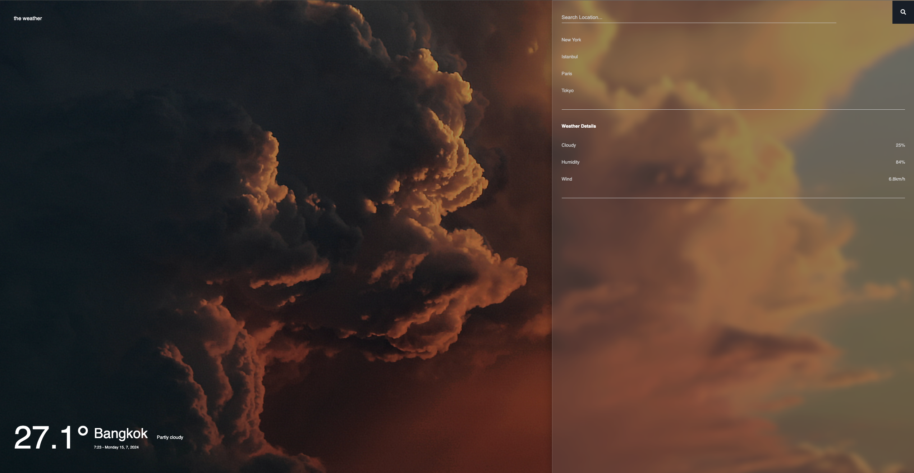

# Project: Weather Application ⛅

## Languages / Langues / Idiomas
- [English](#english) 🇬🇧
- [Français](#français) 🇫🇷
- [Español](#español) 🇪🇸

---





## English 🇬🇧

### Description 🌐

This project is a weather application that fetches and displays real-time weather data using **JavaScript**, **HTML**, and **CSS**. It utilizes the WeatherAPI to provide current weather conditions for selected cities. The application dynamically updates the background image based on weather conditions and time of day (day or night).

**Important ❗️: To use this weather application, you need to create a free account on [WeatherAPI](https://www.weatherapi.com/).** After signing up and logging in, you will receive an API key. You need to paste this API key into the `main.js` file at line 52 where the link is. Replace `YOUR_API_KEY` with your actual API key in the following fetch code:

```javascript
fetch(`https://api.weatherapi.com/v1/current.json?key=YOUR_API_KEY&q=${cityInput}`)
```


### Repository Content 📂

#### Main Files 📄

##### `index.html` 📄
The main HTML file of the project. It contains the structure and UI elements of the weather application, including the display of weather details and city selection functionality.

##### `main.js` 📜
This JavaScript file handles fetching weather data from the WeatherAPI, updating the UI with fetched data, and dynamically changing the background image based on weather conditions and time of day.

##### `styles.css` 🎨
The CSS file defining the styles and layout of the weather application. It includes the styling for elements like the weather display, city selection, and overall interface aesthetics.

##### `.gitignore` 📝
Specifies files and directories to be ignored in Git version control, such as API keys or sensitive data.

##### `README.md` 📝
This file contains project details and explanations about the weather application.

##### `images` 📁
This folder contains two subfolders, `day` and `night`, each with four pictures used as background images for different weather conditions.

---

## Français 🇫🇷

### Description 🌐

Ce projet est une application météorologique qui récupère et affiche des données météorologiques en temps réel en utilisant **JavaScript**, **HTML** et **CSS**. Il utilise l'API WeatherAPI pour fournir les conditions météorologiques actuelles pour les villes sélectionnées. L'application met à jour dynamiquement l'image de fond en fonction des conditions météorologiques et de l'heure de la journée (jour ou nuit).

**Important ❗️ : Pour utiliser cette application météo, vous devez créer un compte gratuit sur [WeatherAPI](https://www.weatherapi.com/).** Après vous être inscrit et connecté, vous recevrez une clé API . Vous devez coller cette clé API dans le fichier « main.js » à la ligne 52 où se trouve le lien. Remplacez `YOUR_API_KEY` par votre clé API réelle dans le code fetch suivant :

```javascript
fetch(`https://api.weatherapi.com/v1/current.json?key=YOUR_API_KEY&q=${cityInput}`)
```

### Contenu du Repository 📂

#### Fichiers Principaux 📄

##### `index.html` 📄
Le fichier HTML principal du projet. Il contient la structure et les éléments d'interface utilisateur de l'application météorologique, y compris l'affichage des détails météorologiques et la fonctionnalité de sélection de ville.

##### `main.js` 📜
Ce fichier JavaScript gère la récupération des données météorologiques depuis l'API WeatherAPI, met à jour l'interface utilisateur avec les données récupérées et change dynamiquement l'image de fond en fonction des conditions météorologiques et de l'heure de la journée.

##### `styles.css` 🎨
Le fichier CSS qui définit les styles et la mise en page de l'application météorologique. Il inclut les styles pour des éléments comme l'affichage météorologique, la sélection de ville et l'esthétique générale de l'interface.

##### `.gitignore` 📝
Spécifie les fichiers et répertoires à ignorer dans le contrôle de version Git, tels que les clés d'API ou les données sensibles.

##### `README.md` 📝
Ce fichier contient des détails sur le projet et des explications sur l'application météorologique.

##### `images` 📁
Ce dossier contient deux sous-dossiers, `day` et `night`, chacun avec quatre images utilisées comme images de fond pour différentes conditions météorologiques.

---

## Español 🇪🇸

### Descripción 🌐

Este proyecto es una aplicación meteorológica que obtiene y muestra datos meteorológicos en tiempo real utilizando **JavaScript**, **HTML** y **CSS**. Utiliza la API WeatherAPI para proporcionar las condiciones meteorológicas actuales para ciudades seleccionadas. La aplicación actualiza dinámicamente la imagen de fondo en función de las condiciones meteorológicas y la hora del día (día o noche).

**Importante ❗️: Para utilizar esta aplicación meteorológica, debe crear una cuenta gratuita en [WeatherAPI](https://www.weatherapi.com/).** Después de registrarse e iniciar sesión, recibirá una clave API . Debe pegar esta clave API en el archivo `main.js` en la línea 52 donde está el enlace. Reemplace `YOUR_API_KEY` con su clave API real en el siguiente código de fetch:

```javascript
fetch(`https://api.weatherapi.com/v1/current.json?key=YOUR_API_KEY&q=${cityInput}`)
```


### Contenido del Repositorio 📂

#### Archivos Principales 📄

##### `index.html` 📄
El archivo HTML principal del proyecto. Contiene la estructura y los elementos de la interfaz de usuario de la aplicación meteorológica, incluyendo la visualización de detalles meteorológicos y la funcionalidad de selección de ciudad.

##### `main.js` 📜
Este archivo JavaScript maneja la obtención de datos meteorológicos desde la API WeatherAPI, actualiza la interfaz con los datos obtenidos y cambia dinámicamente la imagen de fondo según las condiciones meteorológicas y la hora del día.

##### `styles.css` 🎨
El archivo CSS que define los estilos y diseño de la aplicación meteorológica. Incluye estilos para elementos como la visualización del clima, la selección de ciudad y la estética general de la interfaz.

##### `.gitignore` 📝
Especifica qué archivos y directorios ignorar en el control de versiones Git, como claves de API o datos sensibles.

##### `README.md` 📝
Este archivo contiene detalles del proyecto y explicaciones sobre la aplicación meteorológica.

##### `images` 📁
Esta carpeta contiene dos subcarpetas, `day` y `night`, cada una con cuatro imágenes utilizadas como fondos para diferentes condiciones meteorológicas.

---
